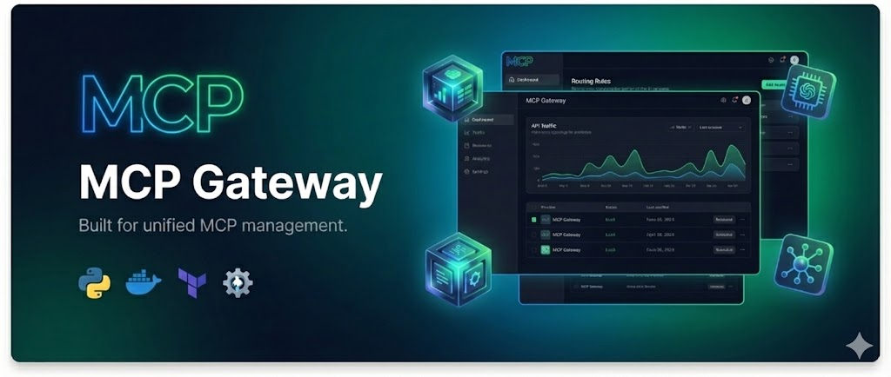

<p align="center">
  
</p>

<h1 align="center">AI Bridge · MCP 隧道网关</h1>
<p align="center"><em>让 Web/云端安全调用本地/内网 MCP 工具的桥接组件：Tunnel Gateway + Bridge Agent。</em></p>

---

## 项目简介
- Tunnel Gateway（Go）：在云端维护 Agent 的 WSS 连接，默认入口 `/bridge/tunnel`，向后端暴露 `/internal/bridge/*` API（列出 Agent、获取工具列表、下发 INVOKE/CANCEL、SSE 事件流、查询 RESULT）。可选 Redis 支持跨实例路由与结果持久化。
- Bridge Agent（Go）：运行在用户机器/服务器，聚合多个 MCP Server（命令行 stdio、HTTP Streamable/SSE），工具统一命名为 `{server}__{tool}`，内置 `bridge__echo` 便于端到端验证；支持日志背压、进度事件、断线重连与 RESULT 重传。
- 配置文件（YAML）：浏览器或用户本地生成，不经云端存储；`bridge config validate/apply` 可校验与落盘。
- Docker Compose 一键启动 Tunnel Gateway；CLI 通过 Go 构建或 GitHub Release 二进制使用。

## 仓库内容
- `bridge/`：Go 源码与 CLI 入口（`bridge agent|gateway|config`）。
- `docker-compose.develop.yml` / `docker-compose.images.yml`：网关本地构建版 / 预构建镜像编排。
- `docs/bridge/design.md`、`docs/bridge/ai-higress-mcp-integration.md`：架构与与 AI-Higress 集成说明。
- `docs/api/bridge.md`：Web/后端对 Tunnel Gateway 的 API 约定。
- `scripts/build-bridge-dist.sh`：多平台 CLI 打包脚本。

## 快速开始

### 1) 启动 Tunnel Gateway（Docker Compose）
前置：Docker 与 docker compose。

```bash
cp .env.example .env
# 填写 SECRET_KEY（用于验证 Agent Token），可选 BRIDGE_GATEWAY_INTERNAL_TOKEN（保护 /internal/bridge/*）。

# 本地构建网关镜像并启动
docker compose -f docker-compose.develop.yml --env-file .env up -d

# 或直接使用已发布镜像
IMAGE_TAG=latest docker compose -f docker-compose.images.yml --env-file .env up -d
```

默认监听 `http://127.0.0.1:8088`，隧道路径 `/bridge/tunnel`，内部 HTTP API 在 `/internal/bridge/*`。

### 2) 准备 Bridge Agent 配置
前置：Go 1.23+（或下载 Release 二进制）。

创建 `config.yaml`（可放在 `~/.ai-bridge/config.yaml`，或项目根的 `.ai-bridge/config.yaml`，也可通过 `--config` 显式指定）：

```yaml
version: v1
server:
  # Tunnel Gateway 的 WS 地址（与 docker compose 暴露一致）
  url: ws://127.0.0.1:8088/bridge/tunnel
  # 可选：Agent Token（若网关启用了 --agent-token-secret，则必须设置）
  token: ""
  reconnect_initial: 1s
  reconnect_max: 60s

agent:
  id: my-agent
  label: dev-laptop
  # CHUNK 日志缓冲与单帧大小（字节）
  chunk_buffer_bytes: 4194304
  chunk_max_frame_bytes: 16384

mcp_servers:
  # 本地 stdio MCP Server 示例
  - name: filesystem
    command: python3
    args: ["-m", "mcp.server.filesystem"]
    env:
      MCP_FILESYSTEM_ROOT: /Users/me

  # 远程 Streamable/SSE MCP Server 示例
  - name: prompts
    url: https://example.com/mcp
    type: auto            # auto|streamable|http|sse|legacy_sse
    headers:
      Authorization: Bearer sk-xxxxx
```

校验与落盘：

```bash
# 检查配置
bridge config validate --file ./config.yaml

# 写入默认路径 (~/.ai-bridge/config.yaml)，方便后续不带 --config 运行
bridge config apply --file ./config.yaml
```

### 3) 运行 Agent
```bash
# 连接云端 Tunnel Gateway，聚合 MCP 并上报工具列表
bridge agent start --config ./config.yaml

# 仅作为本地 MCP Server 聚合器（不走云端隧道，可供 Claude/Cursor 直接接入）
bridge agent serve-mcp --config ./config.yaml
```

连接成功后，后端可通过 `/internal/bridge/invoke` 调用命名空间工具（包含内置 `bridge__echo`），通过 `/internal/bridge/tool-events` SSE 订阅状态/日志/结果。

## 配置要点
- 配置查找顺序：`--config` > `<当前目录向上查找>/.ai-bridge/config.yaml` > `~/.ai-bridge/config.yaml`。
- `server.url` 必填（WS 地址）；`server.token` 仅在网关启用 `--agent-token-secret` 时要求填写。
- `mcp_servers[*].command` 用于本地 stdio/子进程 MCP；`mcp_servers[*].url` 用于远程 HTTP/Streamable MCP，`type` 支持 `auto|streamable|http|sse|legacy_sse`。
- 日志背压：`agent.chunk_buffer_bytes` 控制在内存中队列的最大字节数，超限会丢弃并在 CHUNK 中上报 `dropped_bytes/dropped_lines`；`agent.chunk_max_frame_bytes` 控制单帧大小。

## 构建与发布
- 构建多平台 CLI 二进制：
  ```bash
  bash scripts/build-bridge-dist.sh --version bridge-v0.1.0
  ```
- 构建/推送网关镜像（手动）：
  ```bash
  docker build -f bridge/Dockerfile.gateway -t mcpproxy-gateway:dev ./bridge
  ```
  GitHub Actions 工作流 `bridge-gateway-docker-publish.yml` 会在 push/tag 时自动构建并推送 `marshalleriksen/mcpproxy-gateway:<tag>`。
- Release 标签 `bridge-v*` 会触发 CLI 产物构建与发布（`bridge-release.yml`）。

## 相关文档
- 架构设计与集成：`docs/bridge/design.md`，`docs/bridge/ai-higress-mcp-integration.md`
- API 说明：`docs/api/bridge.md`
- Redis/HA 流程图：`docs/images/bridge-token-flow.svg`
